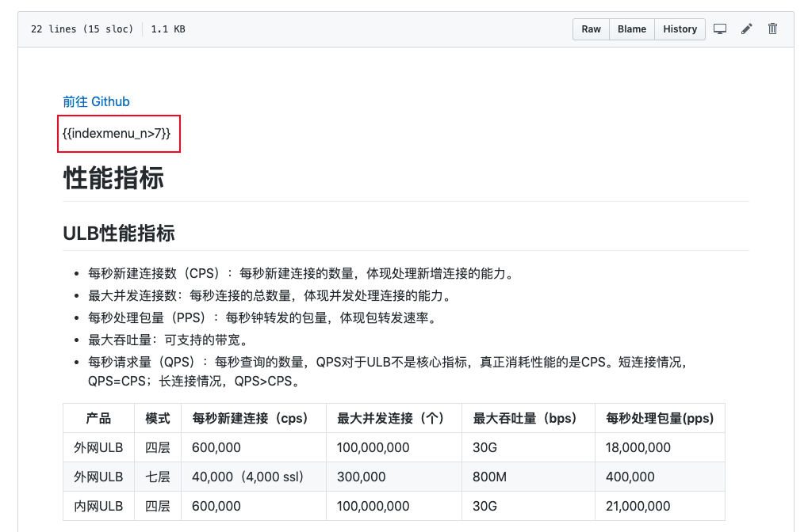
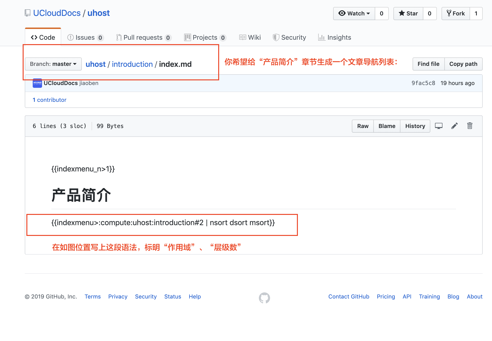
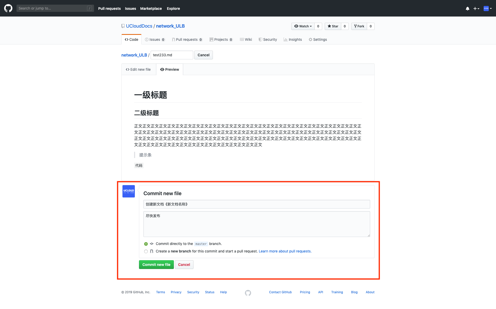
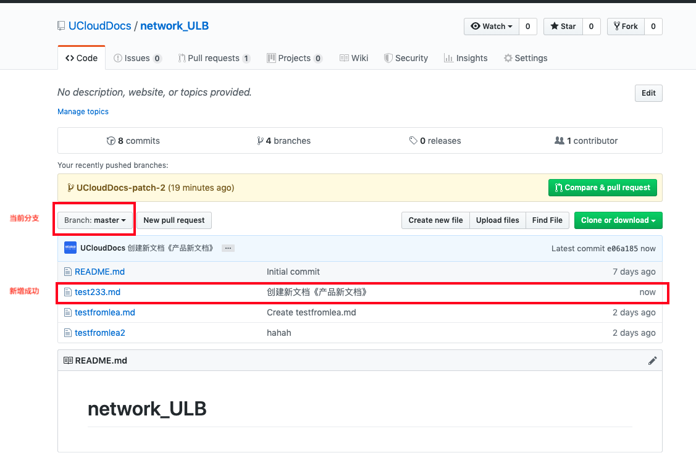

[<<返回](https://leaishere.github.io/docs_new/)

------

# 在github网页上创建文档

除了对线上文档的修改，产品经理还需要**_新增章节、小节或文章/新增产品小类/新增产品大类_**：

* **仅新增章节、小节或文章**：新建文件夹（章节、小节目录）或新建 _.md_ 文件（单篇文章）
* **仅新增产品小类**：联系主仓库管理者，新建仓库（产品小类）
* **新增产品大类**：在github侧完成仓库新建、文件添加后，联系平台产品经理在前端页面导航中增设大类
* **隐藏导航内产品目录**：联系平台产品经理  

# 那么，我们开始创作文档吧！

### 新开文档

找到UCloudDocs账号，并进入目标仓库。在你所需创建文档的层级下，点击“create a new file”进入编辑页面。

### 命名文档

在路径上填入本篇文档名称（必须使用英文并添加后缀.md），开始在“edit”区域进行markdown写作。

### 编写文档

* md样式预览：当前默认在“edit”标签下，可点击切换至“preview”查看样式预览；
* [Md语法说明](https://www.jianshu.com/p/40ba812dd973)
* [范例_ULB文档](https://github.com/UCloudDocs/UCloud-document/tree/master/network/ulb)
* wiki向md转译后的样式问题 👇详见《常见问题》章节

### 自定义文章排序

由于前端平台短期内仍使用dokuwiki，因此页面排序仍由indexmenu语法支持。

在正文写入 {{indexmenu_n>数值}} 。**_通过修改“数值”来改变顺序，数值无需连贯，越小，当前文章则越靠前。_**

### 添加多媒体素材

##### 方法1相对地址引用

使用仓库根目录下的“images”存放图片（ [如何创建文件夹>>](常见问题) ）：

> 写法：
>
> images/my_pic.png

##### 方法2 绝对地址引用：[图床>>](http://docs.ucloudadmin.com/5b10f62667ded1519074449f/edit)

> 写法：
>
>   https://static.ucloud.cn/jueduidzhi.jpg

### 生成页面导航（方式与dokuwiki教程一致）

若希望自己文档，在点击章节标题时展示章节内所有文章的**导航链接列表**，可以使用indexmenu语法。

如

以上生成了“compute:ugc”作用域下的“一级”标题的导航链接列表。

在我们改为github编辑后，你只需要找到对应的“index.md”并按照原规则，在文档中写下命令即可。

如图所示：

语法说明参考 [dokuwiki官方文档>>](https://www.dokuwiki.org/plugin:indexmenu)

### 提交新文件

编辑完成后，在“propose new file”模块写明本次创建请求。若为其他账号协作编辑，此模块可以向仓库拥有者说明情况。

### 完成本次新增

仓库拥有者若直接在master分支上编辑，确认后改文档将直接出现在仓库列表里（如下图）。仓库中存在于master分支上的内容，都将在每次发布时被推送至线上。

